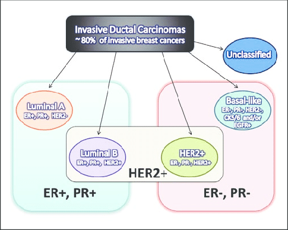

```{r settings, include=FALSE, echo=FALSE, eval=TRUE}
library(knitr)
library(kableExtra)
library(data.table)

# library(formattable)

options(width = 300)
# options(encoding = 'UTF-8')
knitr::opts_chunk$set(
  fig.width = 7, fig.height = 5, 
  fig.path = 'figures/TCGA_BIC_',
  fig.align = "center", 
  size = "tiny", 
  echo = TRUE, eval = TRUE, 
  warning = FALSE, message = FALSE, 
  results = TRUE, comment = "")

options(scipen = 12) ## Max number of digits for non-scientific notation
# knitr::asis_output("\\footnotesize")

```


```{r options}
## Define parameters for the analysis
parameters <- list(
  epsilon = 0.1,
  gene.filter.min.count = 10,
  gene.filter.percent.zeros = 95,
  gzip.output.files = TRUE
)

kable(t(data.frame(parameters)), col.names = "Parameter value")

```


## Introduction


## Data source

**Recount2** (https://jhubiostatistics.shinyapps.io/recount/) is a database rasembling several thousands of human RNA-seq studies, that were all processed with a same workflow in order to ensure the consistency of the transcriptome measurements. Recount2 provides direct access to tables of raw counts per gene, exon or transcript. 


## Requirements

- Recount library: <https://bioconductor.org/packages/release/bioc/html/recount.html>

```{r}
# Install BiocManager if required
if (!requireNamespace("BiocManager", quietly = TRUE))
    install.packages("BiocManager")

# Install recount if required
if (!require(recount)) {
  BiocManager::install("recount", version = "3.8")
  require(recount)
}

# BiocManager::valid()

```


## Working directory


```{r workdir}
## Set the working directory
workdir <- "~/TCGA_import"
dir.create(workdir, recursive = TRUE, showWarnings = FALSE)
setwd(workdir)

## Select a TCGA project
selected.project <- "Breast Invasive Carcinoma"
project.acronym <- "BIC"
message("\tSelected TCGA project\t", selected.project, " (", project.acronym, ")")

export.dir <- file.path(workdir, "data", project.acronym)
message("\tExport directory\t", export.dir)
dir.create(export.dir, recursive = TRUE, showWarnings = FALSE)

```


The downloaded and processed data will be saved in a working directory named **TCGA_import** in the user home folder (``r workdir).  If required this directory is created automatically. 


## Data source

```{r download data}

#### Download the TCGA data from Recount2 database ####

## Set the recoutnID (to "TCGA")
recountID <- "TCGA"

# Specify the download directory
download.dir <- file.path(workdir, "downloads", recountID)
dir.create(download.dir, recursive = TRUE, showWarnings = FALSE)


## Data types to download
#download.types <- c("phenotype", "counts-gene", "rse-gene")
download.types <- c("rse-gene") # the rse-gene object contains both expression and pheno tables
localFiles <- c()
for (type in download.types) {
  message("Recount data type: ", type)
  ## Get the URL of the recount file 
  ## (its extension will depend on the data type)
  recountURL <- download_study(
    recountID, 
    outdir = download.dir, 
    type = type, 
    download = FALSE)
  message("\trecountURLL: ", recountURL)
  
  ## Define the local file name
  localFile <- file.path(download.dir, basename(recountURL))
  message("\tlocalFile: ", localFile)

  ## Index local file for later use
  localFiles[type] <- localFile

  
  ## Download the data only if required
  if (!file.exists(localFile)) {
    message("\tDowloading ", type, " from ReCount for study ", recountID)
    url <- download_study(
      recountID, 
      outdir = download.dir, 
      type = type)
  } else {
    message("\tfile already there: ", localFile)
    
  }
}
## Download the gene-level RangedSummarizedExperiment data
# download_study(project = "TCGA", type = "counts-gene", outdir = download.dir)
```

We downloaded the following file types from Recount2: `r paste(collapse = ", ", download.types)`.

## Data loading

```{r result=FALSE}

# ## Choose a way to load the data. 
# ## either from the Rdata file or from the TSV files . 
# loadRdata <- TRUE 
# 
# 
# if (loadRdata) {
## Load the RData memory image provided by Recount2, whcih contains the count table + pheno table
message("Loading Recount file for TCGA")
load(localFiles["rse-gene"])


## Extract the pheno table from the rse-gene object
phenoTable <- colData(rse_gene) ## phenotype per run
project.name <- "Breast invasive carcinoma"
message("Identifying samples for project ", project.name)
project.samples <- phenoTable$gdc_cases.tissue_source_site.project == project.name
message("\tNumber of project samples: ", sum(project.samples))

## Select the columns relevant for the Breast cancer study
immuno.columns <- c(
  ER = "xml_breast_carcinoma_estrogen_receptor_status",
  PR = "xml_breast_carcinoma_progesterone_receptor_status",
  HER2 = "xml_lab_proc_her2_neu_immunohistochemistry_receptor_status")
message("Immuno marker columns:\n\t", paste(collapse = "\n\t", immuno.columns))

## Only keep project samples with valid markers (i.e. Negative or Positive), discard Undertermined, Equivocal and  NA
valid.markers <- c("Negative", "Positive")
message("Selecting samples with valid immuno markers: ", paste(collapse = ", ", valid.markers))
valid.samples <- 
  project.samples &
  apply(is.na(phenoTable[, immuno.columns]), 1, sum) == 0 &
  phenoTable[, immuno.columns["ER"]] %in% valid.markers &
  phenoTable[, immuno.columns["PR"]] %in% valid.markers &
  phenoTable[, immuno.columns["HER2"]] %in% valid.markers
# table(valid.samples)
message("\tvalid samples: ", sum(valid.samples))

## Subset the expression data by selecting the valid samples
message("Extracting expression data for valid samples")
rse.valid.samples <- subset(rse_gene, select = valid.samples)  
# dim(rse.valid.samples)

## Extract a pheno table for the subset
pheno <- colData(rse.valid.samples)
# dim(pheno.valid.samples)

## Scale counts by mapped reads, in order to to get read counts per gene
#rse.valid.samples.scaled <- scale_counts(rse.valid.samples, by = "mapped_reads")
# summary(assay(rse.valid.samples.scaled)[,1:7])
## WARNING: THIS DOES NOT WORK WITH THIS DATASET: ALL VALUES ARE SET TO 0.
## I THIS COMMENT IT

## Extract the count table from the rse-gene object
message("Extracting counts per gene")
counts.per.gene <- assay(rse.valid.samples)
# summary(counts.per.gene[, 1:10])
# dim(counts.per.gene)


# dim(phenoTable)
## NOTE: this phenoTable is a complex object: a DataFrame whose cells may be a list containing a table. 
## To avoid messing around, I prefer to use the TSV version of the pheno table.
# dim(pheno)
# class(pheno)

#   
#   # dim(countTable)
# } else {
#   ## Load the data from the TSV files downloaded from Recount2
#   
#   
#   ## Load the TCGA count table.
#   ## We use gzfile to directly load the zgipped file, 
#   ## and data.table:::fread() to accelerate the reading. 
#   ## system.time(counts.per.gene <- read.delim(file = gzfile(localFiles["counts-gene"]))) ## This takes 430 seconds
#   message("Loading counts per gene")
#   system.time(counts.per.gene <- fread(file = localFiles["counts-gene"]))
#   # This takes 29 seconds
# 
#   ## Load the TCGA pheno table
#   message("Reading phenotype table")
#   pheno <- read.delim(file = localFiles["phenotype"])
#   # dim(pheno)
#   
#   # dim(counts.per.gene) 
# }

  
message("Selected dataset (project and valid markers)")
message("\tRead count table contains ", nrow(counts.per.gene), " rows (genes) x ", ncol(counts.per.gene), " columns (samples). ")
message("\tPheno table contains ", nrow(pheno), " rows (samples) x ", ncol(pheno), " columns (sample attributes). ")
  
```

The full TCGA gene count table contains `r ncol(counts.per.gene)` samples (columns) and `r nrow(counts.per.gene)` genes (rows).

```{r samples_per_project}
kable(sort(table(phenoTable$gdc_cases.project.name), decreasing = TRUE),
      caption = "Number of samples per TGCA project. ", 
      col.names = c("Project","samples"))

```


For the study case, we select the project **`r sum(project.samples)`**, which contains `r sum(project.samples)` samples.


## Class labels


The class of cancer is defined by combining three immunological markers:

- HER2, 
- ER (estrogen receptor)
- Pr (progesterone receptor)

The tables below provide summaries of the marker status for all samples.

```{r marker_summary}
project.markers <- phenoTable[project.samples, immuno.columns]
colnames(project.markers) <- names(immuno.columns)
summary(as.data.frame(project.markers))
```

Marker status summary after having discarded invalid values. 

```{r valid_marker_summary}
valid.markers <- phenoTable[valid.samples, immuno.columns]
colnames(valid.markers) <- names(immuno.columns)
summary(as.data.frame(valid.markers))
```


We discard the samples for which any of the markers is undefined (`NA`), "Indeterminate" or "Equivocal". In total, this leaves us with `r sum(valid.samples)` samples.

We then assign a class label to each sample, indicating its cancer subtype, which is assigned based on the combination of the three immunological markers. 



```{r class_labels}
## Define sample classes based on the combination of 3 marker values
pheno$cancer.type <- rep("Unclassified", length.out = nrow(pheno))

luminal.A <- 
  pheno[, immuno.columns["ER"]] == "Positive" &
  pheno[, immuno.columns["PR"]] == "Positive" &
  pheno[, immuno.columns["HER2"]] == "Negative"
pheno[luminal.A, "cancer.type"] <- "Luminal.A"

luminal.B <- 
  pheno[, immuno.columns["ER"]] == "Positive" &
  pheno[, immuno.columns["PR"]] == "Positive" &
  pheno[, immuno.columns["HER2"]] == "Positive"
pheno[luminal.B, "cancer.type"] <- "Luminal.B"

her2plus <- 
  pheno[, immuno.columns["ER"]] == "Negative" &
  pheno[, immuno.columns["PR"]] == "Negative" &
  pheno[, immuno.columns["HER2"]] == "Positive"
pheno[her2plus, "cancer.type"] <- "HER2pos"

basal.like <- 
  pheno[, immuno.columns["ER"]] == "Negative" &
  pheno[, immuno.columns["PR"]] == "Negative" &
  pheno[, immuno.columns["HER2"]] == "Negative"
pheno[basal.like, "cancer.type"] <- "Basal.like"

kable(sort(decreasing = TRUE, table(pheno[, "cancer.type"])), useNA = "ifany", caption = "Number of samples per cancer subtype. Cancer subtypes were defined based on the combination of HER2, ER and PR markers. ")

## Get the identifiers of the selected samples
selected.sample.ids <- rownames(pheno)
# summary(selected.sample.ids %in% colnames(counts.per.gene))
# summary(colnames(counts.per.gene) %in% selected.sample.ids)

## Get the subset of the big count table corresponding to our selected IDs
## Note the special notation due to the specific class of the fread() result.
# if (!loadRdata) {
#   selected.counts <- as.data.frame(counts.per.gene[, ..selected.sample.ids])
# }
# dim(selected.counts)
# summary(selected.counts[, 1:10])
# summary(counts.per.gene[, 1:10])
```


****************************************************************

## Gene filtering

```{r gene_filtering_zero_counts, out.width = "80%", fig.width=7, fig.height=4.5, fig.cap="Frequency of samples with zero counts per gene. Genes exceeding the thresold (red arrow) were filtered out. "}


## Discard genes having zeros in at least 95% of samples
message("Applying threshold on the percent of non-zero counts per gene: ", parameters$gene.filter.percent.zeros, "%")
percent.zeros <- 100*apply(counts.per.gene == 0, 1, sum) / ncol(counts.per.gene)
hist(percent.zeros, breaks = 20, col = "#DDDDDD", 
     main = "Filter on the percentage of zero counts", 
     xlab = "Percent of samples", ylab = "Number of genes", las = 1)
arrows(x0 = parameters$gene.filter.percent.zeros, 
       y0 = 10000, 
       x1 = parameters$gene.filter.percent.zeros, 
       y1 = 6000, 
       col = "red", lwd = 2,
       angle = 30, length = 0.1)
text(x = parameters$gene.filter.percent.zeros, 
     y = 10000, 
     labels = paste(sep = "", parameters$gene.filter.percent.zeros, "%"),
     col = "red", pos = 3)
```

```{r gene_filtering_min_count, out.width = "80%", fig.width=7, fig.height=4.5, fig.cap="Distribution of min counts per gene. Genes below the thresold (red arrow) are filtered out. "}

min.count <- apply(counts.per.gene, 1, min)
summary(min.count)
hist(log2(min.count + parameters$epsilon), breaks = 100, col = "#BBBBFF",
     xlab = "log2(min count per gene)",
     ylab = "Number of genes", las = 1,
     main = "Filtering on min count per gene")
arrows(x0 = log2(parameters$gene.filter.min.count), 
       y0 = 3000, 
       x1 = log2(parameters$gene.filter.min.count), 
       y1 = 1000, 
       col = "red", lwd = 2,
       angle = 30, length = 0.1)
text(x = log2(parameters$gene.filter.min.count), 
     y = 3000, 
     labels = paste(sep = "", "log2(", 
                    parameters$gene.filter.min.count,
                    ") = ", signif(digits = 3, log2(parameters$gene.filter.min.count))),
     col = "red", pos = 3)

```

```{r gene_filtering}
filtered.out.genes <- 
  percent.zeros > parameters$gene.filter.percent.zeros |
  min.count < parameters$gene.filter.min.count
# table(kept.genes)

## Genes passing the filters
filtered.genes <- !filtered.out.genes

```


We discard "undetected" genes, i.e. those having zero counts in at least `r parameters$gene.filter.percent.zeros` percent of the samples, or those with a maximal count inferior to `r parameters$gene.filter.min.count`. This led us to discard `r sum(filtered.out.genes)` genes. 

## Differential expression

We select differentially expressed genes in order to produce a file with a restricted number of genes for clustering.

```{r}
## Install the library if needed then load it
if (!require("DESeq2")) {
  source("http://bioconductor.org/biocLite.R")
  biocLite("DESeq2")
}
require("DESeq2")

## Use the DESeqDataSetFromMatrix to create a DESeqDataSet object
dds0 <- DESeqDataSetFromMatrix(
  countData = as.data.frame(counts.per.gene), 
  colData = data.frame(cancer.type = as.factor(pheno[, "cancer.type"])), 
  design = ~ cancer.type)

# print(dds0) # Have a look at the short description of the DESeqDataSet

## Run  differential expression analysis with DESeq2
dds0 <- DESeq(dds0)

# Cast the results from DESeq differential expression analysis
DEGtable <- results(dds0, independentFiltering = FALSE)

```


## Normalization of the counts per gene

We use DESeq2 function  `estimateSizeFactors()` to estimate the library-wise size factors, which will be used to standardize the counts. 

We then apply a log2 transformation in order to normalize these standardized counts.

```{r count_normalisation}

## Normalizing using the method for an object of class"CountDataSet" 
dds.norm <-  estimateSizeFactors(dds0)
# sizeFactors(dds.norm)

counts.norm <- counts(dds.norm) + parameters$epsilon
# dim(counts.norm)
counts.log2.norm <- log2(counts.norm)
# dim(counts.log2.norm)

```

```{r norm_count_hist, out.width="80%", fig.width=7, fig.height=5, fig.cap="**Histogram of the nornmalized counts.** Normalization consists in scaling counts in order to ensure library size standardization, followed by a  log2 transformation. "}

hist(unlist(counts.log2.norm), main = "Distribution of normalized counts",
     xlab = "log2(standardized counts)",
     ylab = "Number of measures",
     breaks = 100, 
     col = "#FFDDBB")

```


****

## Exported tables

The selected counts per gene and pheno table were exported in tab-separated value (TSV) format. 

```{r}

pheno.export.columns <- names(pheno)
for (col in pheno.export.columns) {
  ## Discard columns containing only NA values
  nona <- sum(!is.na(pheno[, col]))
  if (nona == 0) {
    # message("\tDiscarding NA-only pheno column\t", col, "\tnoNA = ", nona)
    pheno.export.columns <- setdiff(pheno.export.columns, col)
  }
  
  # Discard columns containing muli-value lists
  if (class(pheno[, col]) == "list") {
    message("\tDiscarding list-type pheno column\t", col)
    pheno.export.columns <- setdiff(pheno.export.columns, col)
    
  }
}
message("Exporting ", length(pheno.export.columns), " pheno columns among ", ncol(pheno))

## Export the non-problematic columns of the pheno table
pheno.file <- paste(sep = "", project.acronym, "_pheno.tsv.gz")
pheno.path <- file.path(export.dir, pheno.file)
if (parameters$gzip.output.files) {
  pheno.path <- gzfile(pheno.path, "w") ## Compress file
}
write.table(x = as.data.frame(pheno[, pheno.export.columns]), 
            file = pheno.path, 
            sep = "\t", quote = FALSE, row.names = FALSE)
if (parameters$gzip.output.files) {
  close(pheno.path)
}

## Export a small subset of relevant fields from the pheno table
pheno.selected.columns <- c(
  "cancer.type",
  immuno.columns
)
sample.class.file <- paste(sep = "", project.acronym, "_sample-classes.tsv.gz")
sample.class.path <- file.path(export.dir, sample.class.file)
if (parameters$gzip.output.files) {
  sample.class.path <- gzfile(sample.class.path, "w") ## Compress file
}
write.table(x = as.data.frame(pheno[, pheno.selected.columns]), 
            file = sample.class.path, 
            sep = "\t", quote = FALSE, row.names = FALSE)
if (parameters$gzip.output.files) {
  close(sample.class.path)
}


## Export counts per gene
count.file <- paste(sep = "", project.acronym, "_counts_all-genes.tsv")
count.path <- file.path(export.dir, count.file)
if (parameters$gzip.output.files) {
  count.path <- gzfile(count.path, "w") ## Compress file
}
write.table(x = counts.per.gene, 
            file = count.path,
            sep = "\t", quote = FALSE, row.names = TRUE, col.names = NA)
if (parameters$gzip.output.files) {
  close(count.path)
}

## Export raw counts
filtered.count.file <- paste(sep = "", project.acronym, "_counts_filtered-genes.tsv")
filtered.count.path <- file.path(export.dir, filtered.count.file)
if (parameters$gzip.output.files) {
  filtered.count.path <- gzfile(filtered.count.path, "w") ## Compress file
}
write.table(x = counts.per.gene[filtered.genes, ], 
            file = filtered.count.path,
            sep = "\t", quote = FALSE, row.names = TRUE, col.names = NA)
if (parameters$gzip.output.files) {
  close(filtered.count.path)
}

# list.files(export.dir)

## Export normalized counts
norm.count.file <- paste(sep = "", project.acronym, "_log2-norm-counts_all-genes.tsv")
norm.count.path <- file.path(export.dir, norm.count.file)
if (parameters$gzip.output.files) {
  norm.count.path <- gzfile(norm.count.path, "w") ## Compress file
}
write.table(x = counts.log2.norm, 
            file = norm.count.path,
            sep = "\t", quote = FALSE, row.names = TRUE, col.names = NA)
if (parameters$gzip.output.files) {
  close(norm.count.path)
}

## Export normalized counts
filtered.norm.count.file <- paste(sep = "", project.acronym, "_log2-norm-counts_filtered-genes.tsv")
filtered.norm.count.path <- file.path(export.dir, filtered.norm.count.file)
if (parameters$gzip.output.files) {
  filtered.norm.count.path <- gzfile(filtered.norm.count.path, "w") ## Compress file
}
write.table(x = counts.log2.norm[filtered.genes, ], 
            file = filtered.norm.count.path,
            sep = "\t", quote = FALSE, row.names = TRUE, col.names = NA)
if (parameters$gzip.output.files) {
  close(filtered.norm.count.path)
}


```


- Export directory: `r export.dir`
- Pheno table: `r pheno.file`
- Counts per gene (all genes): `r count.file`
- Counts per gene (filtered genes): `r filtered.count.file`

- Normalized counts per gene (all genes): `r norm.count.file`
- Normalized counts per gene (filtered genes): `r filtered.norm.count.file`

****************************************************************

Contact: <Jacques.van-Helden@univ-amu.fr>

